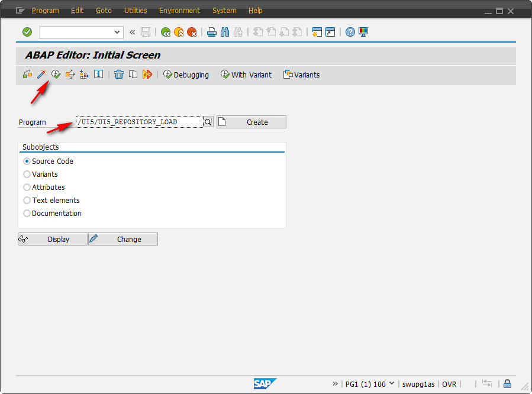
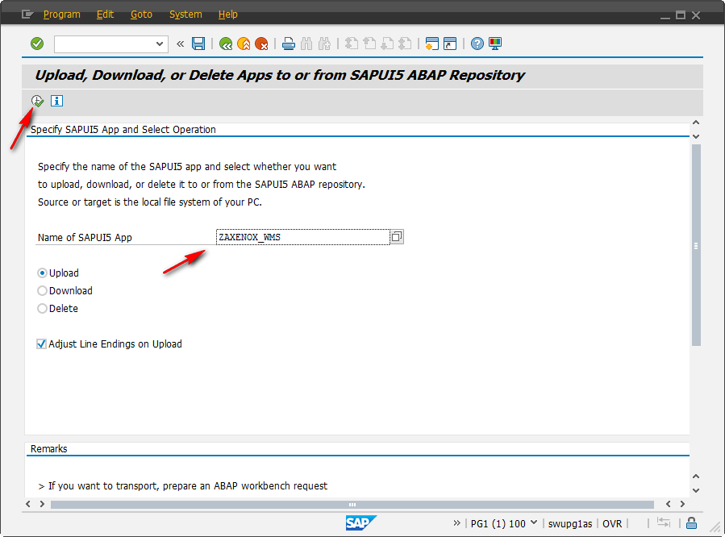
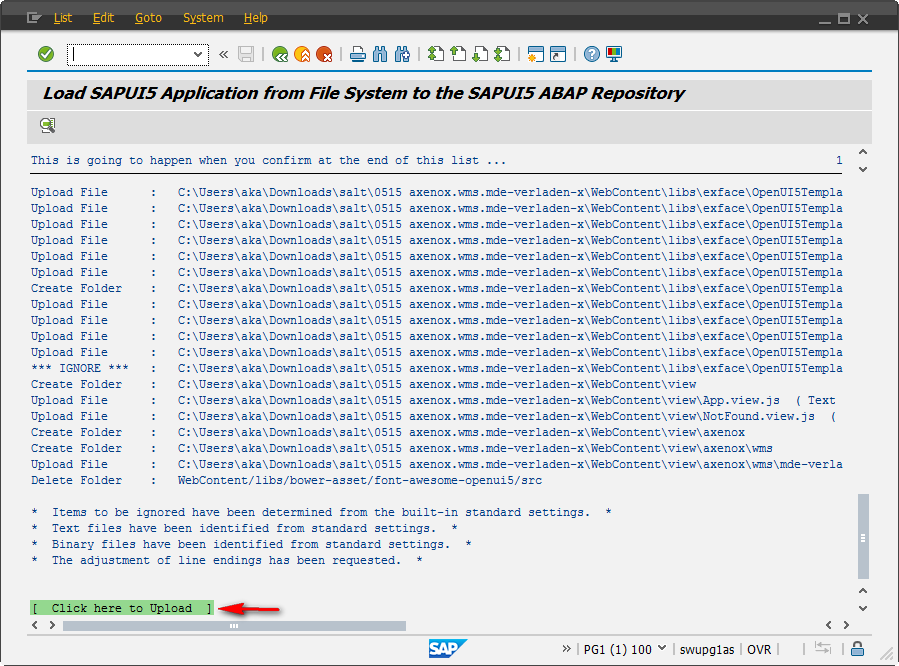
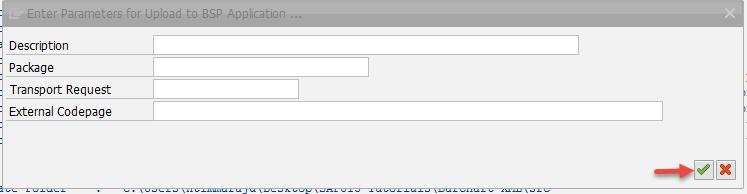
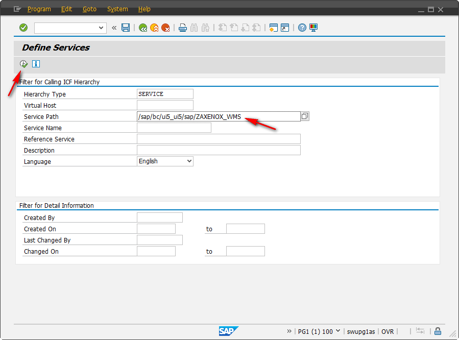
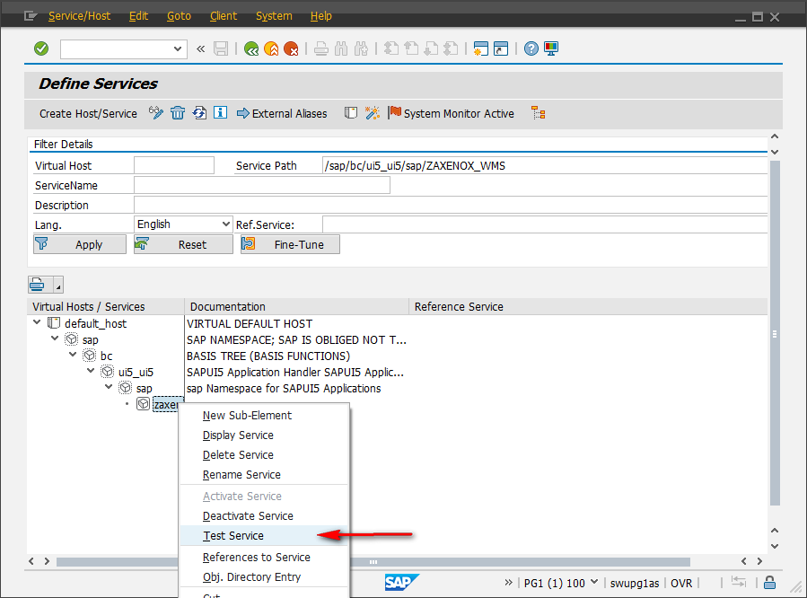

# Deploy an exported app on ABAP NetWeaver Gateway

First of all, you need to export a Fiori web app as described [here](export_fiori_app.md).

## Upload exported app

Log on to the SAP Netweaver Gateway system/Front-end server and go to transaction `SE38` (enter "se38" in the nav-box on SAP main screen) and provide the program name as `/UI5/UI5_REPOSITORY_LOAD` and click on the execute icon up left. You will see the below screen.

Provide the name for your SAPUI5 Application and choose Upload. The name should start with a "Z". Typically it should consist of uppercase letters, number and underscores. If an app with the provided name already exists, it will be updated by the upload. 

Now execute the report (icon in the upper left). You will see a popup to choose the folder in which you have saved the SAPUI5 application (the one containing the WebContent subfolder). Once you have selected the folder, click on OK.

You will see a report displayed like below, which contains all the files which are going to create.Please verify all the files which are going to create and click on "Click here to upload".

A popup window will appear like below. Enter the parameters in the window and click OK.These parameters are not mandatory.

On successful upload, you will be re-directed to initial screen. Otherwise you will see a log of actions performed and a summary below.

## Run the app

Now we need to test the SAPUI5 application which is deployed. Go to the transaction code SICF and enter the Service Path `/sap/bc/ui5_ui5/sap/` followed by your app name. Now press execute.

You will be navigated to the screen below, where you should right-click your application (at the bottom of the tree) and click "Test Service".

Now a browser should open and show your application. From now on it will be available on the opened URL.

If you want it to appear in the Fiori launchpad, continue with the [corresponding tutorial](deploy_on_fiori_launchpad.md).